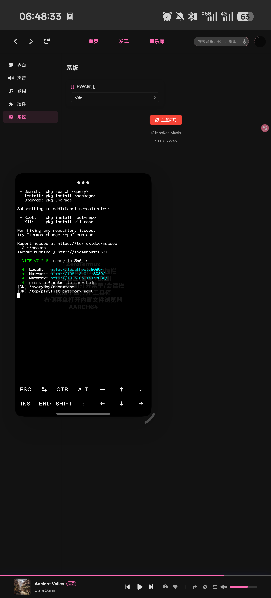
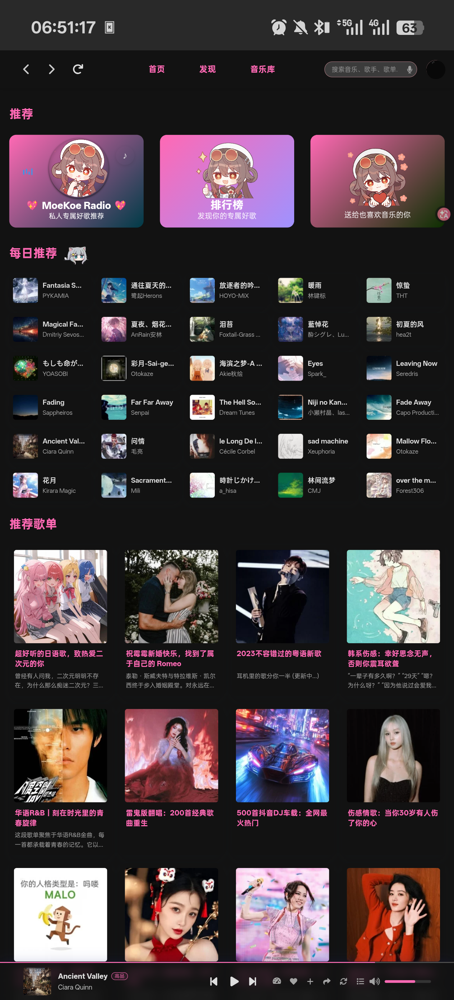

# MoeKoe Music — Termux 部署指南

在 Android ARM64 设备上，用 ZeroTermux + Node.js 直跑 [MoeKoe Music](https://github.com/MoeKoeMusic/MoeKoeMusic)（酷狗第三方高颜值播放器），无需 Docker、无需 Electron。

## 适用场景
- 在安卓端用上moekoe_music
- 手上有一台闲置 Android 手机，想跑个私人音乐服务器
- 不想用 Docker / 不想折腾云服务器
- 需要 PWA 桌面全屏体验（类原生 App）

## 架构

```
浏览器/PWA :8080  →  Vite 前端 (Vue.js)
         ↓ API
    Node.js :6521  →  酷狗音乐 API
```

## 快速开始

详见 [MoeKoe_Music_Termux部署指南.md](./MoeKoe_Music_Termux部署指南.md)

## 硬件要求

- ARM64 设备（骁龙/天玑/麒麟均可）
- Android 7+
- 约 500MB 存储空间

## 测试设备

| 设备 | SoC | 系统 | 状态 |
|------|-----|------|------|
| OnePlus Ace 5 Pro | SM8750 (8 Elite) | Android 15 / ZeroTermux | ✅ 正常 |


## 部署成功参考图

### ZeroTermux + PWA 页面


### PWA 页面

## 使用到的开源项目
- ZeroTermux(https://github.com/hanxinhao000/ZeroTermux)
- Termux(https://github.com/termux/termux-app)
- Moekoe_music(https://github.com/MoeKoeMusic/MoeKoeMusic)
